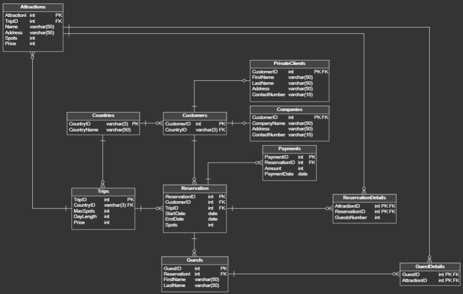

---
# Bazy danych


**Autorzy:** Mikołaj Durkot, Jakub Pomorski, Dawid Wójtowicz

--- 

# 1.	Wymagania i funkcje systemu

Wymagania:
Informacje o cenie i zawartości wycieczek
Przewoźnicy
Opiekunowie i przewodnicy
Tabela klientów i turystów
Miasta i ich atrakcje
Kontrola dat wycieczek np. 7 dni przed jej startem

Funkcje admina:
Wyświetlanie bazy użytkowników i wycieczek
Tworzenie nowych wycieczek
Usuwanie nieaktualnych wycieczek
Modyfikacja aktualnych wycieczek (ceny i dostępne podopcje)

Funkcje klienta:
Wyświetlanie dostępnych wycieczek
Wyświetlanie dodatkowych opcji dla każdej wycieczki
Zapisywanie turystów (niekoniecznie klienta) na wycieczki
Wypisanie na min. 7 dni przed startem wycieczki.
Prośba o realizację prywatnej wycieczki (info o niej mają admin i klient oraz jej uczestnicy).

# 2.    Baza danych

### Schemat bazy danych

### Opis poszczególnych tabel:
- #### Attractions
Tabela ta opisuje poszczególne atrakcje dla każdej wycieczki.

| Nazwa atrybutu | Typ | Opis/Uwagi |
| -------------- | --- | ---------- |
| AttractionID   | int    |  ID Atrakcji do identyfikacji          |
| TripID    |   int  |     ID Wycieczki      |
| Name    |  varchar(50)   |     Nazwa atrakcji       |
| Address    |  varchar(50)   |  Adres atrakcji (miejsce/region)          |
| MaxSpots    |   int  |   Maks. liczba uczestnikow         |
| Price    |  int   |   Cena za pojedynczą atrakcję         |
- #### Companies
Tabela ta zawiera dane o firmach, które kupują u nas wycieczki.
| Nazwa atrybutu | Typ | Opis/Uwagi |
| -------------- | --- | ---------- |
| CustomerID   | int    |  ID klienta do identyfikacji          |
| CompanyName | varchar(50) | Nazwa firmy |
| Address | varchar(50) | Adres firmy |
| ContactNumber | varchar(15) | Numer telefonu do kontaktu |
- #### Countries
Tabela słownikowa zawierająca nazwę kraju dla każdego 3-literowego kodu państwa zgodnie ze standardem ISO 3166-1 alfa-3.
| Nazwa atrybutu | Typ | Opis/Uwagi |
| -------------- | --- | ---------- |
| CountryID | varchar(3) | ID Państwa |
| CountryName | varchar(50) | Nazwa państwa |
- #### Customers
Tabela ta zawiera podstawowe informacje o kliencie - jego id i kraj.
| Nazwa atrybutu | Typ | Opis/Uwagi |
| -------------- | --- | ---------- |
| CustomerID | int | ID Klienta |
| CountryID | varchar(3) | ID Państwa |
- #### GuestDetails
Tabela ta zawiera pary gość-atrakcja, służące do powiązania poszczególnych gości do poszczególnych atrakcji.
| Nazwa atrybutu | Typ | Opis/Uwagi |
| -------------- | --- | ---------- |
| GuestID | int | ID Gościa |
| AttractionID | int | ID Atrakcji |
- #### Guests
Tabela zawiera informacje o uczestnikach wycieczki.
| Nazwa atrybutu | Typ | Opis/Uwagi |
| -------------- | --- | ---------- |
| GuestID | int | ID Gościa |
| ReservationID | int | ID Rezerwacji |
| FirstName | varchar(50) | Imię gościa |
| LastName | varchar(50) | Nazwisko gościa |

- #### Trips
Tabela opisująca wycieczki znajdujące się w stałej ofercie.

| Nazwa atrybutu | Typ | Opis/Uwagi |
| -------------- | --- | ---------- |
| TripID    |  int  |   ID Wycieczki       |
| CountryID  |   varchar(15)  |   ID Kraju    |
|   Spots         |     int           |   Maksymalna ilość miejsc na wycieczce   |
|   DayLength                 |       int            |       Długość wycieczki w dniach                                   |
|         Price           |        int           |         Cena całej wycieczki (nie wliczając atrakcji)                                 |

- #### ReservationDetails
Tabela zawiera informacje wiążace rezerwacje z wykupionymi atrakcjami.

| Nazwa atrybutu | Typ | Opis/Uwagi |
| -------------- | --- | ---------- |
| AttractionID    |  int  |   ID Atrakcji       |
| ReservationID  |   int  |   ID Rezerwacji    |
| AttendeesNumber | int | Ilość gości przypisanych do danej atrakcji |

- #### Reservation
Tabela zawiera informacje dotyczące poszczególnych rezerwacji.

| Nazwa atrybutu | Typ | Opis/Uwagi |
| -------------- | --- | ---------- |
| ReservationID  |   int  |   ID Rezerwacji    |
| CustomerID  |   int  |   ID Klienta    |
| TripID    |  int  |   ID Wycieczki       |
| StartDate    |  date  |   Data rozpoczęcia      |
| EndDate    |  date  |   Data zakończenia      |
| Spots | int | Ilość zarezerwowanych miejsc |


- #### PrivateClients
Tabela zawiera informacje o klientach, którzy są osobami prywatnymi.

| Nazwa atrybutu | Typ | Opis/Uwagi |
| -------------- | --- | ---------- |
| CustomerID  |   int  |   ID Klienta    |
| FirstName    |  varchar(50)  |  Imię klienta       |
| LastName    |  varchar(50)  |   Nazwisko klienta       |
| Address    |  varchar(50)  |   Adres klienta     |
| ContactNumber | varchar(15) | Numer telefonu klienta (razem z numerem kierunkowym) |


- #### Payments
Tabela zawiera informacje dotyczące płatności. 

| Nazwa atrybutu | Typ | Opis/Uwagi |
| -------------- | --- | ---------- |
| PaymentID  |   int  |   ID Płatności   |
| ReservationID  |   int  |   ID Rezerwacji    |
| Amount    |  int  |   Wartość płatności      |
| PaymentDate   |  date  |   Data zaksięgowania płatności     |

### Kod DDL
```sql
-- tables
-- Table: Attractions
CREATE TABLE Attractions (
    AttractionID int  NOT NULL,
    TripID int  NOT NULL,
    Name varchar(50)  NOT NULL,
    Address varchar(50)  NOT NULL,
    Spots int  NOT NULL,
    Price int  NOT NULL,
    CONSTRAINT Attractions_pk PRIMARY KEY  (AttractionID)
);

-- Table: Companies
CREATE TABLE Companies (
    CustomerID int  NOT NULL,
    CompanyName varchar(50)  NOT NULL,
    Address varchar(50)  NOT NULL,
    ContactNumber varchar(15)  NOT NULL,
    CONSTRAINT Companies_pk PRIMARY KEY  (CustomerID)
);

-- Table: Countries
CREATE TABLE Countries (
    CountryID varchar(3)  NOT NULL,
    CountryName varchar(50)  NOT NULL,
    CONSTRAINT Countries_pk PRIMARY KEY  (CountryID)
);

-- Table: Customers
CREATE TABLE Customers (
    CustomerID int  NOT NULL,
    CountryID varchar(3)  NOT NULL,
    CONSTRAINT CustomerID PRIMARY KEY  (CustomerID)
);

-- Table: GuestDetails
CREATE TABLE GuestDetails (
    GuestID int  NOT NULL,
    AttractionID int  NOT NULL,
    CONSTRAINT GuestDetails_pk PRIMARY KEY  (GuestID,AttractionID)
);

-- Table: Guests
CREATE TABLE Guests (
    GuestID int  NOT NULL,
    ReservationID int  NOT NULL,
    FirstName varchar(50)  NOT NULL,
    LastName varchar(50)  NOT NULL,
    CONSTRAINT Guests_pk PRIMARY KEY  (GuestID)
);

-- Table: Payments
CREATE TABLE Payments (
    PaymentID int  NOT NULL,
    ReservationID int  NOT NULL,
    Amount int  NOT NULL,
    PaymentDate date  NOT NULL,
    CONSTRAINT Payments_pk PRIMARY KEY  (PaymentID)
);

-- Table: PrivateClients
CREATE TABLE PrivateClients (
    CustomerID int  NOT NULL,
    FirstName varchar(50)  NOT NULL,
    LastName varchar(50)  NOT NULL,
    Address varchar(50)  NOT NULL,
    ContactNumber varchar(15)  NOT NULL,
    CONSTRAINT PrivateClients_pk PRIMARY KEY  (CustomerID)
);


-- Table: Reservation
CREATE TABLE Reservation (
    ReservationID int  NOT NULL,
    CustomerID int  NOT NULL,
    TripID int  NOT NULL,
    StartDate date  NOT NULL,
    EndDate date  NOT NULL,
    Spots int  NOT NULL,
    CONSTRAINT Reservation_pk PRIMARY KEY  (ReservationID)
);

-- Table: ReservationDetails
CREATE TABLE ReservationDetails (
    AttractionID int  NOT NULL,
    ReservationID int  NOT NULL,
    GuestsNumber int  NOT NULL,
    CONSTRAINT ReservationDetails_pk PRIMARY KEY  (ReservationID,AttractionID)
);

-- Table: Trips
CREATE TABLE Trips (
    TripID int  NOT NULL,
    CountryID varchar(3)  NOT NULL,
    MaxSpots int  NOT NULL,
    DayLength int  NOT NULL,
    Price int  NOT NULL,
    CONSTRAINT TripID PRIMARY KEY  (TripID)
);

-- foreign keys
-- Reference: GuestsDetails_Guests (table: GuestDetails)
ALTER TABLE GuestDetails ADD CONSTRAINT GuestsDetails_Guests
    FOREIGN KEY (GuestID)
    REFERENCES Guests (GuestID);

-- Reference: GuestsDetails_Attractions (table: GuestDetails)
ALTER TABLE GuestDetails ADD CONSTRAINT GuestsDetails_Attractions
    FOREIGN KEY (AttractionID)
    REFERENCES Attractions (AttractionID);

-- Reference: Attractions_Trips (table: Attractions)
ALTER TABLE Attractions ADD CONSTRAINT Attractions_Trips
    FOREIGN KEY (TripID)
    REFERENCES Trips (TripID);

-- Reference: Clients_Customers (table: PrivateClients)
ALTER TABLE PrivateClients ADD CONSTRAINT Clients_Customers
    FOREIGN KEY (CustomerID)
    REFERENCES Customers (CustomerID);

-- Reference: Companies_Customers (table: Companies)
ALTER TABLE Companies ADD CONSTRAINT Companies_Customers
    FOREIGN KEY (CustomerID)
    REFERENCES Customers (CustomerID);

-- Reference: Customers_Countries (table: Customers)
ALTER TABLE Customers ADD CONSTRAINT Customers_Countries
    FOREIGN KEY (CountryID)
    REFERENCES Countries (CountryID);

-- Reference: Payments_Reservation (table: Payments)
ALTER TABLE Payments ADD CONSTRAINT Payments_Reservation
    FOREIGN KEY (ReservationID)
    REFERENCES Reservation (ReservationID);

-- Reference: ReservationDetails_Attractions (table: ReservationDetails)
ALTER TABLE ReservationDetails ADD CONSTRAINT ReservationDetails_Attractions
    FOREIGN KEY (AttractionID)
    REFERENCES Attractions (AttractionID);

-- Reference: ReservationDetails_Reservation (table: ReservationDetails)
ALTER TABLE ReservationDetails ADD CONSTRAINT ReservationDetails_Reservation
    FOREIGN KEY (ReservationID)
    REFERENCES Reservation (ReservationID);

-- Reference: Reservation_Customers (table: Reservation)
ALTER TABLE Reservation ADD CONSTRAINT Reservation_Customers
    FOREIGN KEY (CustomerID)
    REFERENCES Customers (CustomerID);

-- Reference: Reservation_Guests (table: Guests)
ALTER TABLE Guests ADD CONSTRAINT Reservation_Guests
    FOREIGN KEY (ReservationID)
    REFERENCES Reservation (ReservationID);

-- Reference: Reservation_Trips (table: Reservation)
ALTER TABLE Reservation ADD CONSTRAINT Reservation_Trips
    FOREIGN KEY (TripID)
    REFERENCES Trips (TripID);

-- Reference: Trips_Countries (table: Trips)
ALTER TABLE Trips ADD CONSTRAINT Trips_Countries
    FOREIGN KEY (CountryID)
    REFERENCES Countries (CountryID);
```
