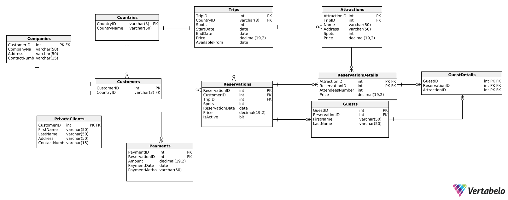
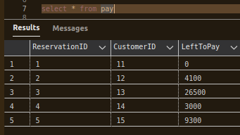
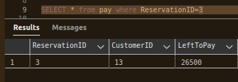
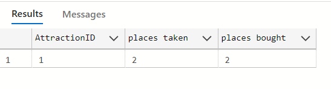

---
# Bazy danych


**Autorzy:** Mikołaj Durkot, Jakub Pomorski, Dawid Wójtowicz

--- 

# 1.	Wymagania i funkcje systemu

Wymagania:
- Informacje o cenie i zawartości wycieczek
- Przewoźnicy
- Opiekunowie i przewodnicy
- Tabela klientów i turystów
- Miasta i ich atrakcje
- Kontrola dat wycieczek np. 7 dni przed jej startem

Funkcje admina:
- Wyświetlanie bazy użytkowników i wycieczek
- Tworzenie nowych wycieczek
- Usuwanie nieaktualnych wycieczek
- Modyfikacja aktualnych wycieczek (ceny i dostępne podopcje)

Funkcje klienta:
- Wyświetlanie dostępnych wycieczek
- Wyświetlanie dodatkowych opcji dla każdej wycieczki
- Zapisywanie turystów (niekoniecznie klienta) na wycieczki
- Wypisanie na min. 7 dni przed startem wycieczki.
- Prośba o realizację prywatnej wycieczki (info o niej mają admin i klient oraz jej uczestnicy).

# 2.    Baza danych

### Schemat bazy danych

### Opis poszczególnych tabel:
- #### Attractions
Tabela ta opisuje poszczególne atrakcje dla każdej wycieczki.

| Nazwa atrybutu | Typ | Opis/Uwagi |
| -------------- | --- | ---------- |
| AttractionID | int | ID Atrakcji do identyfikacji |
| TripID | int | ID Wycieczki |
| Name |  varchar(50) | Nazwa atrakcji |
| Address | varchar(50) | Adres atrakcji (miejsce/region) |
| Spots | int | Maks. liczba uczestnikow |
| Price | int | Cena za pojedynczą atrakcję |

```sql
-- Tabela: Attractions
CREATE TABLE Attractions (
    AttractionID int  NOT NULL,
    TripID int  NOT NULL,
    Name varchar(50)  NOT NULL,
    Address varchar(50)  NOT NULL,
    Spots int  NOT NULL,
    Price int  NOT NULL,
    CONSTRAINT Attractions_pk PRIMARY KEY  (AttractionID)
);

--Powiązanie: Attractions_Trips
ALTER TABLE Attractions ADD CONSTRAINT Attractions_Trips
    FOREIGN KEY (TripID)
    REFERENCES Trips (TripID);
```


- #### Companies
Tabela ta zawiera dane o firmach, które kupują u nas wycieczki.
| Nazwa atrybutu | Typ | Opis/Uwagi |
| -------------- | --- | ---------- |
| CustomerID   | int    |  ID klienta do identyfikacji          |
| CompanyName | varchar(50) | Nazwa firmy |
| Address | varchar(50) | Adres firmy |
| ContactNumber | varchar(15) | Numer telefonu do kontaktu |

```sql
-- Tabela: Companies
CREATE TABLE Companies (
    CustomerID int  NOT NULL,
    CompanyName varchar(50)  NOT NULL,
    Address varchar(50)  NOT NULL,
    ContactNumber varchar(15)  NOT NULL,
    CONSTRAINT Companies_pk PRIMARY KEY  (CustomerID)
);

-- Powiązanie: Companies_Customers 
ALTER TABLE Companies ADD CONSTRAINT Companies_Customers
    FOREIGN KEY (CustomerID)
    REFERENCES Customers (CustomerID);
```

- #### Countries
Tabela słownikowa zawierająca nazwę kraju dla każdego 3-literowego kodu państwa zgodnie ze standardem ISO 3166-1 alfa-3.
| Nazwa atrybutu | Typ | Opis/Uwagi |
| -------------- | --- | ---------- |
| CountryID | varchar(3) | ID Państwa |
| CountryName | varchar(50) | Nazwa państwa |

```sql
-- Tabela: Countries
CREATE TABLE Countries (
    CountryID varchar(3)  NOT NULL,
    CountryName varchar(50)  NOT NULL,
    CONSTRAINT Countries_pk PRIMARY KEY  (CountryID)
);
```
- #### Customers
Tabela ta zawiera podstawowe informacje o kliencie - jego id i kraj.
| Nazwa atrybutu | Typ | Opis/Uwagi |
| -------------- | --- | ---------- |
| CustomerID | int | ID Klienta |
| CountryID | varchar(3) | ID Państwa |

```sql
-- Tabela: Customers
CREATE TABLE Customers (
    CustomerID int  NOT NULL,
    CountryID varchar(3)  NOT NULL,
    CONSTRAINT CustomerID PRIMARY KEY  (CustomerID)
);

-- Powiązanie: Customers_Countries 
ALTER TABLE Customers ADD CONSTRAINT Customers_Countries
    FOREIGN KEY (CountryID)
    REFERENCES Countries (CountryID);
```
- #### GuestDetails
Tabela ta zawiera pary gość-atrakcja, służące do powiązania poszczególnych gości do poszczególnych atrakcji.
| Nazwa atrybutu | Typ | Opis/Uwagi |
| -------------- | --- | ---------- |
| GuestID | int | ID Gościa |
| ReservationID | int | ID Rezerwacji |
| AttractionID | int | ID Atrakcji |

```sql
-- Tabela: GuestDetails
CREATE TABLE GuestDetails (
    GuestID int  NOT NULL,
    ReservationID int  NOT NULL,
    AttractionID int  NOT NULL,
    CONSTRAINT GuestDetails_pk PRIMARY KEY  (GuestID,ReservationID,AttractionID)
);

-- Powiązanie: GuestsDetails_Guests 
ALTER TABLE GuestDetails ADD CONSTRAINT GuestsDetails_Guests
    FOREIGN KEY (GuestID)
    REFERENCES Guests (GuestID);

-- Powiązanie: GuestDetails_ReservationDetails
ALTER TABLE GuestDetails ADD CONSTRAINT GuestDetails_ReservationDetails
    FOREIGN KEY (ReservationID,AttractionID)
    REFERENCES ReservationDetails (ReservationID,AttractionID)

-- Powiązanie: GuestsDetails_Attractions 
ALTER TABLE GuestDetails ADD CONSTRAINT GuestsDetails_Attractions
    FOREIGN KEY (AttractionID)
    REFERENCES Attractions (AttractionID);
```

- #### Guests
Tabela zawiera informacje o uczestnikach wycieczki.
| Nazwa atrybutu | Typ | Opis/Uwagi |
| -------------- | --- | ---------- |
| GuestID | int | ID Gościa |
| ReservationID | int | ID Rezerwacji |
| FirstName | varchar(50) | Imię gościa |
| LastName | varchar(50) | Nazwisko gościa |

```sql
-- Tabela: Guests
CREATE TABLE Guests (
    GuestID int  NOT NULL,
    ReservationID int  NOT NULL,
    FirstName varchar(50)  NOT NULL,
    LastName varchar(50)  NOT NULL,
    CONSTRAINT Guests_pk PRIMARY KEY  (GuestID)
);

-- Powiązanie: Reservation_Guests
ALTER TABLE Guests ADD CONSTRAINT Reservation_Guests
    FOREIGN KEY (ReservationID)
    REFERENCES Reservation (ReservationID);
```

- #### Trips
Tabela opisująca wycieczki znajdujące się w stałej ofercie.

| Nazwa atrybutu | Typ | Opis/Uwagi |
| -------------- | --- | ---------- |
| TripID | int | ID Wycieczki |
| CountryID | varchar(3) | ID Kraju |
| Spots | int | Maksymalna ilość miejsc na wycieczce |
| StartDate | date | Data rozpoczęcia wycieczki |
| EndDate | date | Data zakończenia wycieczki |
| Price | int | Cena całej wycieczki (nie wliczając atrakcji) |
| AvailableFrom | date | Data od której wycieczxka jest dostępna do zakupu |

```sql
-- Tabela: Trips
CREATE TABLE Trips (
    TripID int  NOT NULL,
    CountryID varchar(3)  NOT NULL,
    Spots int  NOT NULL,
    StartDate date  NOT NULL,
    EndDate date  NOT NULL,
    Price int  NOT NULL,
    AvailableFrom date  NOT NULL,
    CONSTRAINT TripID PRIMARY KEY  (TripID)
);

-- Powiązanie: Trips_Countries (table: Trips)
ALTER TABLE Trips ADD CONSTRAINT Trips_Countries
    FOREIGN KEY (CountryID)
    REFERENCES Countries (CountryID);
```

- #### ReservationDetails
Tabela zawiera informacje wiążace rezerwacje z wykupionymi atrakcjami.

| Nazwa atrybutu | Typ | Opis/Uwagi |
| -------------- | --- | ---------- |
| AttractionID | int | ID Atrakcji |
| ReservationID  | int | ID Rezerwacji |
| AttendeesNumber | int | Ilość gości przypisanych do danej atrakcji |

```sql
-- Tabela: ReservationDetails
CREATE TABLE ReservationDetails (
    AttractionID int  NOT NULL,
    ReservationID int  NOT NULL,
    AttendeesNumber int  NOT NULL,
    CONSTRAINT ReservationDetails_pk PRIMARY KEY  (ReservationID,AttractionID)
);

-- Powiązanie: ReservationDetails_Attractions 
ALTER TABLE ReservationDetails ADD CONSTRAINT ReservationDetails_Attractions
    FOREIGN KEY (AttractionID)
    REFERENCES Attractions (AttractionID);

-- Powiązanie: ReservationDetails_Reservation 
ALTER TABLE ReservationDetails ADD CONSTRAINT ReservationDetails_Reservation
    FOREIGN KEY (ReservationID)
    REFERENCES Reservation (ReservationID);
```

- #### Reservation
Tabela zawiera informacje dotyczące poszczególnych rezerwacji.

| Nazwa atrybutu | Typ | Opis/Uwagi |
| -------------- | --- | ---------- |
| ReservationID | int | ID Rezerwacji |
| CustomerID  | int | ID Klienta |
| TripID | int  | ID Wycieczki |
| Spots | int | Ilość zarezerwowanych miejsc |
| ReservationDate | date | Data zakupu rezerwacji |
| ToPay | int | Cena rezerwacji |

```sql
-- Tabela: Reservation
CREATE TABLE Reservation (
    ReservationID int  NOT NULL,
    CustomerID int  NOT NULL,
    TripID int  NOT NULL,
    Spots int  NOT NULL,
    ReservationDate date  NOT NULL,
    ToPay int  NOT NULL,
    CONSTRAINT Reservation_pk PRIMARY KEY  (ReservationID)
);


-- Powiązanie: Reservation_Customers (table: Reservation)
ALTER TABLE Reservation ADD CONSTRAINT Reservation_Customers
    FOREIGN KEY (CustomerID)
    REFERENCES Customers (CustomerID);


-- Powiązanie: Reservation_Trips (table: Reservation)
ALTER TABLE Reservation ADD CONSTRAINT Reservation_Trips
    FOREIGN KEY (TripID)
    REFERENCES Trips (TripID);
```

- #### PrivateClients
Tabela zawiera informacje o klientach, którzy są osobami prywatnymi.

| Nazwa atrybutu | Typ | Opis/Uwagi |
| -------------- | --- | ---------- |
| CustomerID  |   int  |   ID Klienta    |
| FirstName    |  varchar(50)  |  Imię klienta       |
| LastName    |  varchar(50)  |   Nazwisko klienta       |
| Address    |  varchar(50)  |   Adres klienta     |
| ContactNumber | varchar(15) | Numer telefonu klienta (razem z numerem kierunkowym) |

```sql
-- Tabela: PrivateClients
CREATE TABLE PrivateClients (
    CustomerID int  NOT NULL,
    FirstName varchar(50)  NOT NULL,
    LastName varchar(50)  NOT NULL,
    Address varchar(50)  NOT NULL,
    ContactNumber varchar(15)  NOT NULL,
    CONSTRAINT PrivateClients_pk PRIMARY KEY  (CustomerID)
);

-- Powiązanie: PrivateClients_Customers 
ALTER TABLE PrivateClients ADD CONSTRAINT PrivateClients_Customers
    FOREIGN KEY (CustomerID)
    REFERENCES Customers (CustomerID);
```


- #### Payments
Tabela zawiera informacje dotyczące płatności. 

| Nazwa atrybutu | Typ | Opis/Uwagi |
| -------------- | --- | ---------- |
| PaymentID | int  | ID Płatności |
| ReservationID | int | ID Rezerwacji |
| Amount | int | Wartość płatności |
| PaymentDate | date | Data zaksięgowania płatności |
| PaymentMethod | varchar(50) | Metoda płatności |

```sql
-- Tabela: Payments
CREATE TABLE Payments (
    PaymentID int  NOT NULL,
    ReservationID int  NOT NULL,
    Amount int  NOT NULL,
    PaymentDate date  NOT NULL,
    PaymentMethod varchar(50)  NOT NULL,
    CONSTRAINT Payments_pk PRIMARY KEY  (PaymentID)
);


-- Powiązanie: Payments_Reservation 
ALTER TABLE Payments ADD CONSTRAINT Payments_Reservation
    FOREIGN KEY (ReservationID)
    REFERENCES Reservation (ReservationID);
```
# 3. Widoki

## Widok pozostałych kwot do zapłaty za wycieczki dla każdej rezerwacji.
```sql
create view pay AS
select r.ReservationID, r.CustomerID,
max(r.ToPay)-isnull(sum(p.Amount),0) as LeftToPay from Reservation r
left join Payments p on r.ReservationID=p.ReservationID
group by r.ReservationID,r.CustomerID
```
## Przykłady użycia



# Widok zapełnionych miejsc w atrakcji w stosunku do miejsc wykupionych
```sql
create view spots_to_bought as
select rd.AttractionID, count(gd.GuestID) as 'places taken', rd.AttendeesNumber as 'places bought'
from GuestDetails gd
join ReservationDetails rd on gd.ReservationID = rd.ReservationID
group by rd.AttractionID, rd.AttendeesNumber
```

## Przykłady użycia


# Widok pozostałych wolnych miejsc dla atrakcji
```sql
CREATE VIEW atstatus AS
SELECT t.TripID, a.AttractionID, (isnull(a.Spots - sum(rd.AttendeesNumber), a.Spots)) as FreeSpots
FROM Reservation r
JOIN ReservationDetails rd on r.ReservationID = rd.ReservationID
RIGHT JOIN Trips t on r.TripID = t.TripID
RIGHT JOIN Attractions a on a.TripID = t.TripID
GROUP BY t.TripID, a.AttractionID, a.Spots
```


